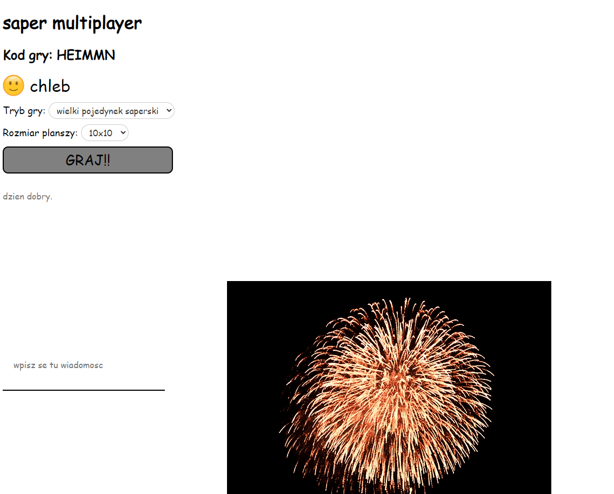

# saper multiplayer
trzecia najlepsza gra we wszechświecie dostępna teraz w wersji open source! 🤠

## Podstawowe pytania

### Jak działa client i dlaczego?
tak

## Instalacja

### Client
- `npm i` bo paczki zainstalować trzeba..
- `npm run build` żeby zbuildować do `build/`, lub też...
- `npm start` żeby uruchomić lokalnie na porcie 1234

### Server
- `npm i`, potem..
- `npm run build`, a następnie...
- `npm start`!

## Ekranu zrzuty
zrzut konkretniej mówiąc jeden, bo więcej mi się nie chciało robić. ale ładny jest więc możecie popatrzeć
